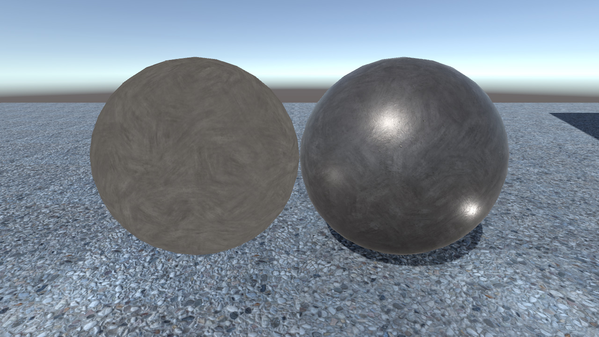
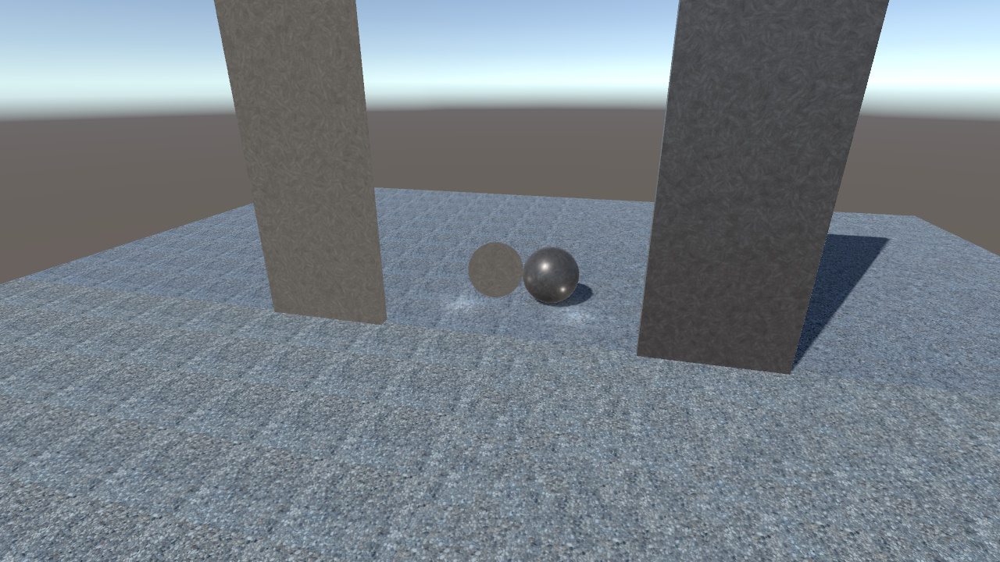

# UnityHexTilingShader

Hex-Tiling Shader for Unity

## Included shaders
- Unlit
- Unlit Tri-planar
- Surface
- Surface Tri-planar

## Usage

1. Download UnityHexTilingShader.unitypackage
  https://github.com/kaiware007/UnityHexTilingShader/releases/

1. Import UnityHexTilingShader.unitypackage to your unity project

## Requeired version
- Unity 2019.4.3f1 later

## Reference  
https://github.com/mmikk/hextile-demo  
https://github.com/keijiro/HexTileTest
